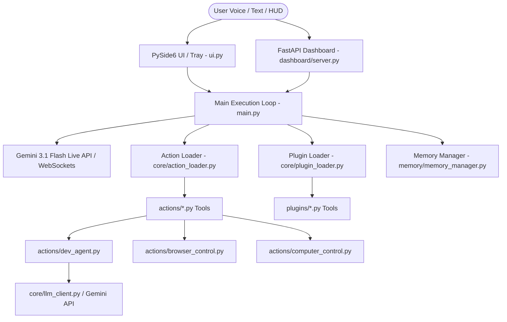

# Arush-Agent: Architecture Analysis & Recommended Evolution

## Executive Summary
This document provides a comprehensive technical analysis of the **Arush-agent** repository. It details the existing system architecture, tool discovery and execution pipelines, LLM interfaces, performance bottlenecks, and a proposed modular architecture for expanding Arush into a full autonomous agent framework without disrupting existing functionality.

---

## 1. Current Architecture Overview



### Key Components

| Component | Primary File(s) | Role & Description |
| :--- | :--- | :--- |
| **Application Entry Point** | [`main.py`](file:///d:/My%20agent/main.py), [`ui.py`](file:///d:/My%20agent/ui.py) | Bootstraps PySide6 HUD UI, initializes `JarvisLive` connection manager, opens sound device streams, and manages Gemini Live WebSocket sessions. |
| **Dashboard Server** | [`dashboard/server.py`](file:///d:/My%20agent/dashboard/server.py) | FastAPI HTTP & WebSocket server (port 8000) providing encrypted remote access, file transfer, and dashboard UI. |
| **LLM Engines** | `google-genai` SDK, [`core/llm_client.py`](file:///d:/My%20agent/core/llm_client.py) | Multimodal Gemini 3.1 Flash Live stream over WebSockets for voice/interactive sessions; local/REST LLM client (Ollama/OpenAI-compatible) for offline or task-specific sub-agents. |
| **Tool Registry & Discovery** | [`core/action_loader.py`](file:///d:/My%20agent/core/action_loader.py), [`core/plugin_loader.py`](file:///d:/My%20agent/core/plugin_loader.py) | Auto-discovers tool modules exposing `TOOL` dicts in `actions/*.py` and `plugins/*.py`. Dynamically builds JSON function declarations for the LLM. |
| **Memory System** | [`memory/memory_manager.py`](file:///d:/My%20agent/memory/memory_manager.py), [`memory/config_manager.py`](file:///d:/My%20agent/memory/config_manager.py) | File-backed JSON memory (`long_term.json`), session transcripts, and configuration persistence (`api_keys.json`). |

---

## 2. Detailed Technical Breakdown

### 2.1 Application Entry Point & Initialization
- **Primary Script**: [`main.py`](file:///d:/My%20agent/main.py)
- **GUI Engine**: PySide6 frameless HUD widget (`JarvisUI` in [`ui.py`](file:///d:/My%20agent/ui.py)) running on the main Qt thread.
- **Live Connection (`JarvisLive`)**: Instantiated inside `main.py`, handles async communication with `models/gemini-3.1-flash-live-preview`.
- **Audio Pipeline**: Reads 16kHz PCM audio chunks via `sounddevice` InputStream, sends them to Gemini WebSocket, and streams 24kHz output audio to `sounddevice` OutputStream.

### 2.2 LLM Flow & Execution Pipeline
1. **Interactive Session**:
   - Connection established using `client.aio.live.connect(model=LIVE_MODEL, config=LiveConnectConfig)`.
   - System prompt loaded from [`core/prompt.txt`](file:///d:/My%20agent/core/prompt.txt) + date/time context + stored user memory + tool declarations.
2. **Sub-Agent / Secondary LLM Calls**:
   - [`core/llm_client.py`](file:///d:/My%20agent/core/llm_client.py) supports Ollama (`/api/chat`) and OpenAI-compatible REST endpoints (LM Studio, Jan, LocalAI).
   - [`actions/dev_agent.py`](file:///d:/My%20agent/actions/dev_agent.py) and [`actions/code_helper.py`](file:///d:/My%20agent/actions/code_helper.py) create independent `genai.Client` calls using `gemini-flash-latest` for non-streaming planning and multi-step execution.

### 2.3 User Request Processing & Voice Pipeline
- **Voice Stream**: Audio continuously sampled when unmuted or triggered by wake word.
- **Wake Word Detection**: [`core/wake_word.py`](file:///d:/My%20agent/core/wake_word.py) uses `openwakeword` for local "Hey Jarvis"/wake phrase detection, putting the assistant into low-power audio listening mode when idle.
- **Text Queries**: Injected into the Gemini session via `send(input=text, end_of_turn=True)`.

### 2.4 Tool Discovery & Execution Pipeline
- **Discovery**:
  - `discover_actions(actions_dir)` in [`core/action_loader.py`](file:///d:/My%20agent/core/action_loader.py) scans all `actions/*.py` files.
  - Requires a module-level `TOOL` dict:
    ```python
    TOOL = {
        "name": "open_app",
        "description": "...",
        "parameters": {"type": "OBJECT", "properties": {...}},
        "handler": open_app
    }
    ```
- **Tool Execution**:
  - When Gemini emits a `tool_call` event over WebSocket, `JarvisLive._handle_tool_call()` invokes `ActionRegistry.run(name, parameters, ctx)`.
  - Signature introspection automatically binds context objects (`player`, `speak`, `response`, `session_memory`).
  - Execution result is wrapped in `LiveClientToolResponse` and sent back over WebSocket.

### 2.5 Memory & Session Handling
- **Long Term Memory**: Saved in `memory/long_term.json` under categories (`identity`, `user`, `preferences`, `facts`).
- **Session Compression & Resumption**: Gemini Live API context uses `types.ContextWindowCompressionConfig` (sliding window) and `types.SessionResumptionConfig` to maintain long conversation sessions.

### 2.6 Capabilities Breakdown

| Capability Category | Target Actions / Components | Description & Implementations |
| :--- | :--- | :--- |
| **Browser Control** | [`actions/browser_control.py`](file:///d:/My%20agent/actions/browser_control.py) | Playwright-based browser driver (page navigation, click, type, screenshot, form fill, text extraction). |
| **System & Desktop** | [`actions/computer_control.py`](file:///d:/My%20agent/actions/computer_control.py), [`actions/computer_settings.py`](file:///d:/My%20agent/actions/computer_settings.py), [`actions/desktop.py`](file:///d:/My%20agent/actions/desktop.py) | PyAutoGUI, Windows Registry, `psutil`, ctypes, volume/brightness control, window manipulation, system shutdown/restart. |
| **File Management** | [`actions/file_processor.py`](file:///d:/My%20agent/actions/file_processor.py), [`actions/file_controller.py`](file:///d:/My%20agent/actions/file_controller.py) | PDF, DOCX, TXT, CSV parsing, file moving, renaming, search, with undo capability ([`core/undo.py`](file:///d:/My%20agent/core/undo.py)). |
| **Coding & Dev Agent** | [`actions/dev_agent.py`](file:///d:/My%20agent/actions/dev_agent.py), [`actions/code_helper.py`](file:///d:/My%20agent/actions/code_helper.py) | Autonomous project creator, multi-file code generator, traceback parser, error classifier (syntax, import, runtime, dependency), and auto-fix loop (up to 5 attempts). |
| **Background Services** | [`actions/background_monitor.py`](file:///d:/My%20agent/actions/background_monitor.py), [`actions/proactive.py`](file:///d:/My%20agent/actions/proactive.py) | Topic tracking, periodic web checks, idle proactive notifications. |

---

## 3. Problems, Limitations & Bottlenecks

1. **Synchronous Tool Execution in Live Stream Loop**:
   - `JarvisLive._execute_tool()` runs tool handlers synchronously inside the async event loop handling the live audio stream.
   - Long-running tools (e.g., Playwright automation or `dev_agent` multi-step builds) freeze/block live WebSocket audio communication.
2. **Monolithic Connection Manager in [`main.py`](file:///d:/My%20agent/main.py)**:
   - [`main.py`](file:///d:/My%20agent/main.py) is over 1,700 lines long, combining UI hooks, audio thread handling, tool registration, prompt assembly, and error handling in a single script.
3. **Lack of Autonomous Multi-Step Agent Architecture**:
   - The current `dev_agent.py` runs a hardcoded fix loop for Python scripts only.
   - There is no generic agent task queue or planner for multi-step tasks across arbitrary domains (web research + file editing + testing + deployment).
4. **Rate Limit Handling**:
   - Sub-agent calls in `dev_agent.py` hit 429 quota limits and retry via simple `time.sleep()`, blocking execution.

---

## 4. Recommended Architecture for Autonomous Agent Integration

To turn Arush into a robust, high-performance autonomous agent while keeping existing voice and HUD capabilities intact:

```
agent/
  ├── __init__.py
  ├── planner.py         # Breaks down complex user requests into discrete step DAGs
  ├── executor.py        # Asynchronous task execution engine with tool dispatch
  ├── memory_store.py    # Vector / indexed task memory and workspace context
  └── state.py           # Task state machine (PENDING, RUNNING, PAUSED, SUCCESS, FAILED)
docs/
  └── AGENT_ARCHITECTURE_ANALYSIS.md
```

### Proposed Workflow:
1. **Decoupled Execution Queue**: When a complex multi-step request arrives (`agent_task`), `main.py` delegates execution to `agent/executor.py` running in a separate worker thread or background `asyncio.Task`.
2. **Async Feedback Loop**: Progress is reported back to `JarvisLive` and `JarvisUI` asynchronously via callbacks without blocking the Live audio stream.
3. **Re-use Existing Action Registry**: `agent/executor.py` directly reuses `ActionRegistry` from [`core/action_loader.py`](file:///d:/My%20agent/core/action_loader.py) and all drivers in `actions/`.

---

## 5. File Modification & Creation Plan

### 5.1 Files to Create [NEW]
- [`docs/AGENT_ARCHITECTURE_ANALYSIS.md`](file:///d:/My%20agent/docs/AGENT_ARCHITECTURE_ANALYSIS.md) - This comprehensive analysis document.
- `agent/__init__.py` - Agent package initialization.
- `agent/planner.py` - Task breakdown & planning engine.
- `agent/executor.py` - Asynchronous non-blocking task runner.
- `agent/state.py` - Task state management and history tracking.

### 5.2 Files to Modify [MODIFY]
- [`main.py`](file:///d:/My%20agent/main.py) - Integrate non-blocking agent task execution for `agent_task` tool.
- [`core/action_loader.py`](file:///d:/My%20agent/core/action_loader.py) - Expose async execution helper `run_async()`.

### 5.3 Files NOT to Modify [DO NOT MODIFY]
- [`actions/browser_control.py`](file:///d:/My%20agent/actions/browser_control.py) - Preserve working Playwright integration.
- [`actions/computer_control.py`](file:///d:/My%20agent/actions/computer_control.py) - Preserve working OS automation.
- [`actions/file_processor.py`](file:///d:/My%20agent/actions/file_processor.py) - Preserve working document parsers.
- [`actions/dev_agent.py`](file:///d:/My%20agent/actions/dev_agent.py) - Keep existing code repair loop working.
- [`dashboard/server.py`](file:///d:/My%20agent/dashboard/server.py) - Keep web dashboard stability intact.
- [`ui.py`](file:///d:/My%20agent/ui.py) - Keep HUD UI rendering intact.

---

## Summary of Reusable Assets
- **Action System**: `actions/*.py` and [`core/action_loader.py`](file:///d:/My%20agent/core/action_loader.py) provide 20+ tested, ready-to-use tools.
- **LLM Connectivity**: Both WebSocket live audio (`main.py`) and local/REST LLM execution ([`core/llm_client.py`](file:///d:/My%20agent/core/llm_client.py)) are fully implemented.
- **Memory & Config**: Config management and long-term memory structures are clean and robust.
