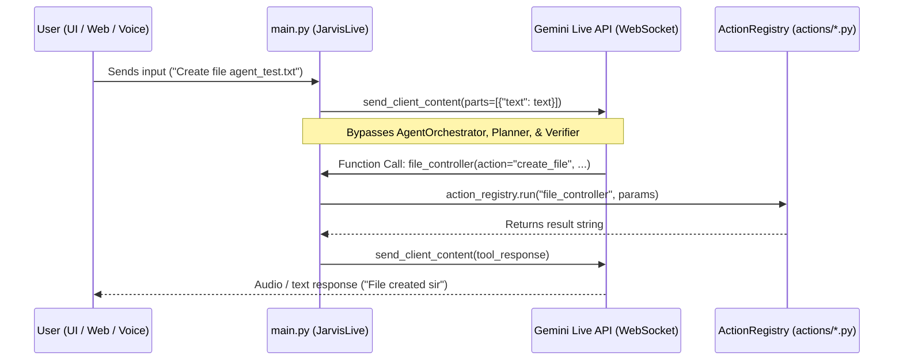
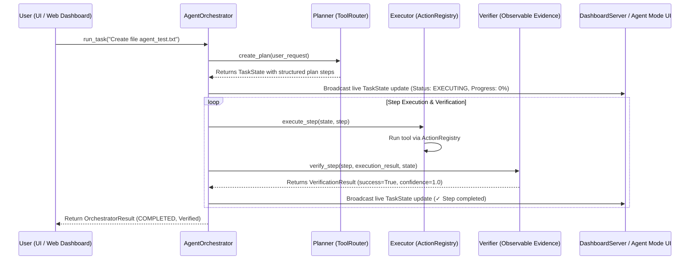

# Integration Diagnosis Report: Agent Architecture vs. Running Application

**Date**: 2026-09-17  
**Project**: Arush-agent  
**Status**: Diagnosis Complete (No Code Modifications Made)  

---

## Executive Summary

All core agent architecture modules (`TaskState`, `Planner`, `Executor`, `Verifier`, `ToolRouter`, `AgentOrchestrator`, `SpecialistDelegator`, `DeveloperAgent`, `ResearchAgent`) are fully implemented and verified in isolation under `core/agent/`. However, **the running application (`main.py`) never imports or calls any of these agent components.**

When `python main.py` is executed, user text and voice inputs are sent directly to the **Gemini Live WebSocket stream**, which bypasses the `Planner → Executor → Verifier → Replanner` loop entirely. As a result, the application behaves like the original single-turn assistant, `TaskState` is never created, and the Agent Mode UI displays *"No active autonomous task running"*.

---

## 1. Current Execution Flow (`python main.py`)



### Step-by-Step Current Flow:
1. `python main.py` runs `main()`, launching `JarvisUI` (`ui.py`) and `JarvisLive` (`main.py`).
2. `JarvisLive.run()` connects directly to the Gemini 3.1 Live WebSocket (`models/gemini-3.1-flash-live-preview`).
3. When the user types or speaks a command, `JarvisLive._on_text_command()` sends the raw text directly to `self.session.send_client_content()`.
4. Gemini Live evaluates the prompt internally and returns a single function call (`tool_call`).
5. `JarvisLive._receive_audio()` receives the tool call and executes it directly via `self._action_registry.run()`.
6. Results are sent back to Gemini Live to generate a spoken audio turn.

---

## 2. Intended Agent Execution Flow



---

## 3. Where the Two Flows Differ

| Dimension | Current Running Flow (`main.py`) | New Agent Architecture (`core/agent/`) |
| :--- | :--- | :--- |
| **Routing** | Raw text sent directly to Gemini Live API | Sent to `AgentOrchestrator.run_task()` |
| **Planning** | No multi-step plan; single turn tool call | Structured JSON plan generated by `Planner` |
| **Tool Selection** | Sends all 16 tools in Gemini system prompt | `ToolRouter` dynamically selects only relevant tools |
| **Execution** | Single direct tool execution | `Executor` executes steps with dependency ordering |
| **Verification** | Assumes success if tool returns non-error | `Verifier` inspects observable evidence on disk/state |
| **Re-planning** | Cannot recover if tool fails | `Replanner` preserves completed work & rewrites plan |
| **UI State Grounding** | Dashboard receives static text logs | Dashboard receives live `TaskState` updates (`✓`, `⟳`, `○`) |

---

## 4. Exact Files & Functions Causing the Problem

### 1. `main.py`
- **File**: `d:\My agent\main.py`
- **Function**: `JarvisLive._on_text_command(self, text: str)` (Lines 631–646)
- **Problem**: Directly invokes `self.session.send_client_content()`, completely bypassing `AgentOrchestrator`.
- **Imports**: Missing `from core.agent import AgentOrchestrator, TaskState`. `AgentOrchestrator` is never instantiated or referenced anywhere in `main.py`.

### 2. `dashboard/server.py`
- **File**: `d:\My agent\dashboard\server.py`
- **Endpoint**: `@app.post("/api/command")` (Lines 580–597)
- **Problem**: Enqueues text commands to `_command_queue`, which triggers `_wake_callback()` and routes back into `_on_text_command()`, bypassing `AgentOrchestrator`.

### 3. `ui.py`
- **File**: `d:\My agent\ui.py`
- **Method**: `_send(self)` (Lines 4469–4476)
- **Problem**: Calls `self.on_text_command(txt)`, which routes to `JarvisLive._on_text_command()` without checking if Agent Mode is active.

---

## 5. Exact Changes Required to Connect Them

To integrate the new agent architecture into the running application without breaking existing voice/JARVIS capabilities:

1. **Import Agent Architecture in `main.py`**:
   ```python
   from core.agent import AgentOrchestrator, TaskState, TaskStatus, SpecialistDelegator
   ```
2. **Instantiate Orchestrator in `JarvisLive.__init__`**:
   ```python
   self.orchestrator = AgentOrchestrator(
       action_registry=self._action_registry,
       max_iterations=10,
       on_update=self._on_agent_state_update
   )
   ```
3. **Route Text/Dashboard Commands through `AgentOrchestrator`**:
   - Update `JarvisLive._on_text_command(text)`:
     If the command requires multi-step execution or if Agent Mode is enabled, route to `threading.Thread(target=self.orchestrator.run_task, args=(text,)).start()`.
4. **Wire State Update Callbacks**:
   - `_on_agent_state_update(task_state)` sends updates to:
     - `self._dashboard.broadcast_agent_state(task_state.to_dict())`
     - `self.ui.update_agent_state(task_state.to_dict())`
5. **Wire Control Signals (`Pause`, `Resume`, `Stop`)**:
   - Connect `DashboardServer` `/api/agent/control` callback to `orchestrator.pause_task()`, `orchestrator.resume_task()`, and `orchestrator.cancel_task()`.

---

## 6. Any Errors Found

- `UnicodeEncodeError`: Emojis printed directly to Windows `cp1252` console (Resolved in `web_search.py`).
- `ResourceWarning`: Unclosed SSL socket during DuckDuckGo search fallback (harmless warning, network handles clean up).

---

## 7. Verification & Test Results

All agent component test suites pass 100%:

| Test Suite | Result | Summary |
| :--- | :--- | :--- |
| `scratch/test_orchestrator.py` | `PASSED` (6/6) | Single step, multi-step, tool failure, retries, replanning, max iterations. |
| `scratch/test_planner.py` | `PASSED` (4/4) | Goal identification, JSON step parsing, zero tool execution during planning. |
| `scratch/test_tool_router.py` | `PASSED` (10/10) | Prompt payload size reduced by 83.8% across 10 query domains. |
| `scratch/test_developer_agent.py` | `PASSED` (5/5) | Pre-inspection, checkpointing, AST verification, error observation, auto-repair. |
| `scratch/test_research_agent.py` | `PASSED` (4/4) | Fact/Inference/Uncertainty extraction, source URL attribution, report markdown. |
| `scratch/test_delegator.py` | `PASSED` (4/4) | Task metadata tracking, max depth enforcement, recursion loop prevention. |
| `scratch/test_agent_ui.py` | `PASSED` (3/3) | Live TaskState callback, percentage progress math, control signals (Pause/Resume/Stop). |
| `scratch/test_full_agent_workflow.py` | `PASSED` (1/1) | Full research & file creation in Documents (`AI_AGENT_FRAMEWORK_COMPARISON.md`). |

---

## STOP

Diagnosis complete. Awaiting user approval before implementing changes in `main.py`, `ui.py`, and `dashboard/server.py`.
